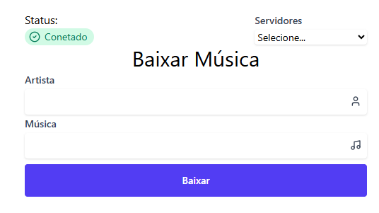

<div style="display: flex; gap: 8px;">
  
  
  
  
  
</div>

# Music Downloader


## Bibliotecas
- [Next](https://www.npmjs.com/package/next)
- [React](https://www.npmjs.com/package/react)
- [Lucide React](https://www.npmjs.com/package/lucide-react)
- [React Virtuoso](https://www.npmjs.com/package/react-virtuoso)
- [WS](https://www.npmjs.com/package/ws)
- [Nodemon](https://www.npmjs.com/package/nodemon)
- [Tailwind CSS](https://www.npmjs.com/package/tailwindcss)
- [TS Node](https://www.npmjs.com/package/ts-node)
- [Cross Env](https://www.npmjs.com/package/cross-env)

## Início Rápido

```bash
# Instalar dependências
yarn

# Rodar o projeto
yarn dev
```